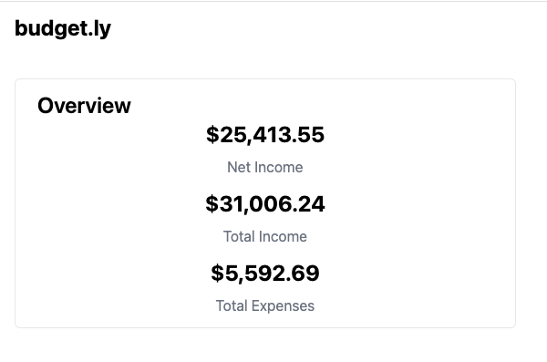
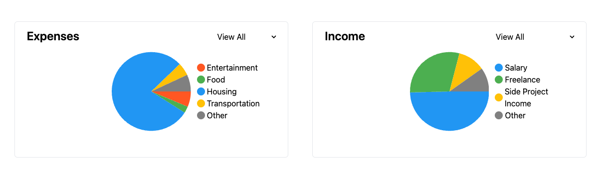
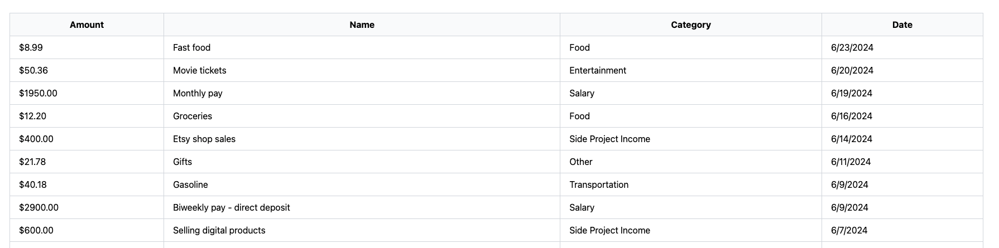
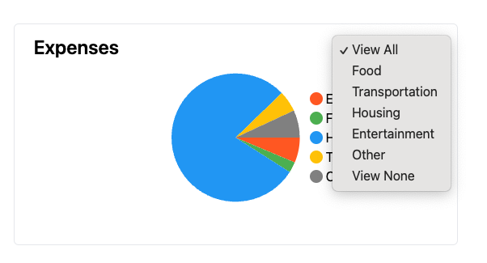

Desired end state:
https://bt-budget-app-challenge.vercel.app/

1. Pull in expense data from [/api/expenses](/src/pages/api/expenses.ts)

2. Create an overview card that lists:

   - Net income (total income - total expenses)
   - Total income
   - Total expenses

   

3. Create pie charts for expenses and income, categorized by type

   

4. Populate the table with all expenses and income data - sort the table by the date column, newest first

   

5. Enable the category filters on the top right of pie charts

   - selecting a category should apply the filter globally
     - eg: it should affect the overview card, the pie chart, and the table data

   
